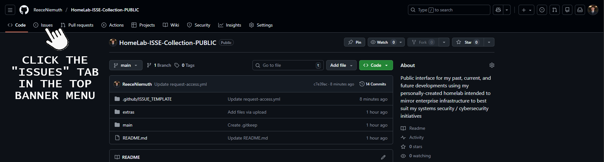
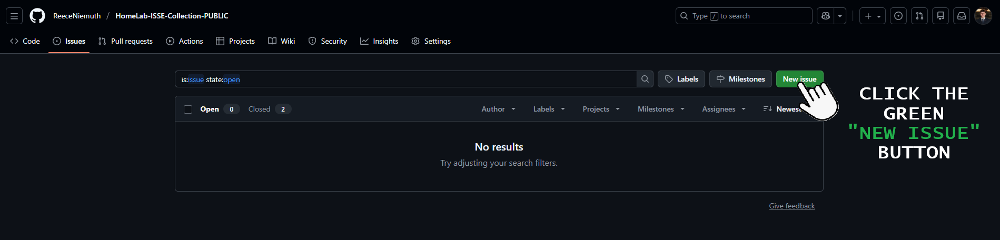
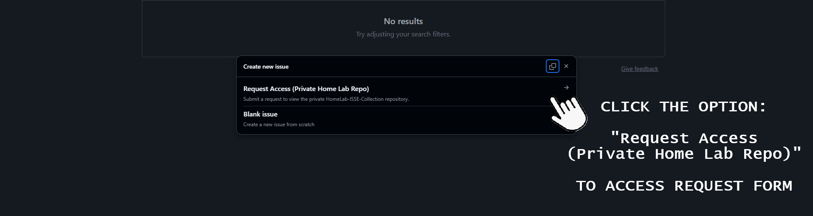
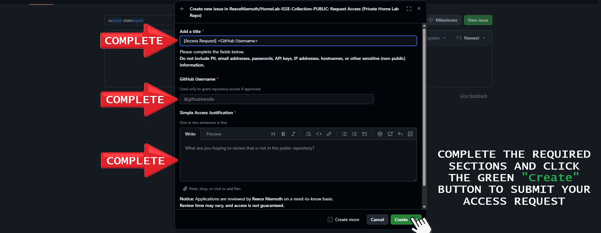

<div align="center">

<p align="center">
  
</p>

<h1>Welcome to my Home Lab Hub!</h1>
  
Public interface for my past, current, and future developments using my personally-created homelab intended to mirror enterprise infrastructure to best suit my systems security / cybersecurity initiatives

---

**🔒 Request Access to the Private Version of this Repository 🔐**

Some details, artifacts, and workflows are intentionally abstracted in this public repository. 

For a deeper look into the current work, implementation details, and supporting material:

#### **[Click here to request access](https://github.com/ReeceNiemuth/HomeLab-ISSE-Collection-PUBLIC/issues/new?template=request-access.yml)**

---

</div>

<p align="left">
  📷 <i><a href="extras/Home_Lab_Hub_Banner.png">Click here to view a Photo of the Lab!</a> </i>
</p>

<p align="left">
  💬 <i><a href="https://github.com/ReeceNiemuth/HomeLab-ISSE-Collection-PUBLIC/issues">Click here to leave feedback or ask a question!</a> </i>
</p>

---

### Directory Structure
```bash
HomeLab-ISSE-Collection-PUBLIC/
│
├── .github/ISSUE_TEMPLATE        # Ingore this, Handles PRIVATE Repository access requests.
│
├── extras/                       # Ingore this, simple storage for PNGs, screenshots, etc.
│
├── main/
│   ├── tooling-and-automation/   # Capabilities considered complete" for automation and tooling.
│   ├── research-notes/           # Lessons Learned and Notes on Developments for the Public.
│   └── rd-experiments/           # Technical Dcoumentation and Research Notes on Apps, Systems,etc.
│
├── showcase/                     # Sanitized screenshots, highlights, and "complete" tooling / projects.
│   └── pcos-project/             # DoD Compliance focused case study, with full comprehensive approach.
│
└── README.md
```

---

### Access Request Link not working, or prefer to manually navigate to the request form?
> Follow the steps provided below to properly submit an access request to the Private Repository Alternative.
‎ 
#### Step 1 : Click on the "Issues" tab in the top left corner, on the GitHub ribbon menu.
<p align="center">
  
</p>

#### Step 2 : Click the green "New Issue" button.
<p align="center">
  
</p>

#### Step 3 : Click the issue option "Request Access (Private Home Lab Repo)".
<p align="center">
  
</p>

#### Step 4 : Complete the form as instructed below and click the green "Create" button.
<p align="center">
  
</p>

#### Step 5 : Sit back and let Reece review your request, and potentially grant you access to the PRIVATE Repository Alternative! 😎

> Note: Feedback should be given if the request was not properly completed, or if further details are needed to make an access decision, please feel free to email me at **reeceniemuth@gmail.com** for access inquiries.
