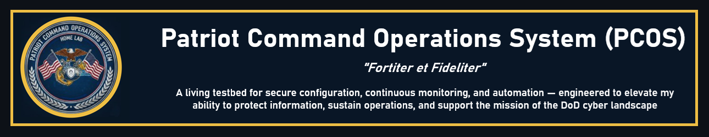
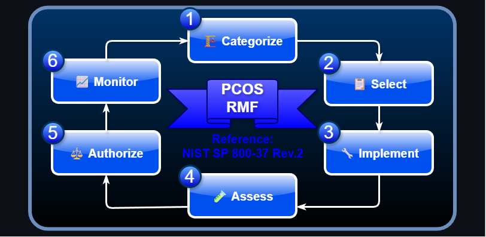
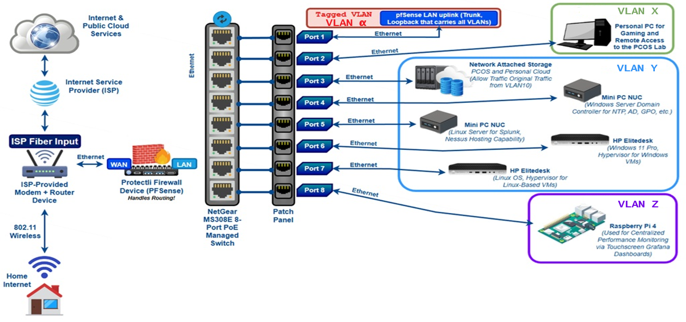
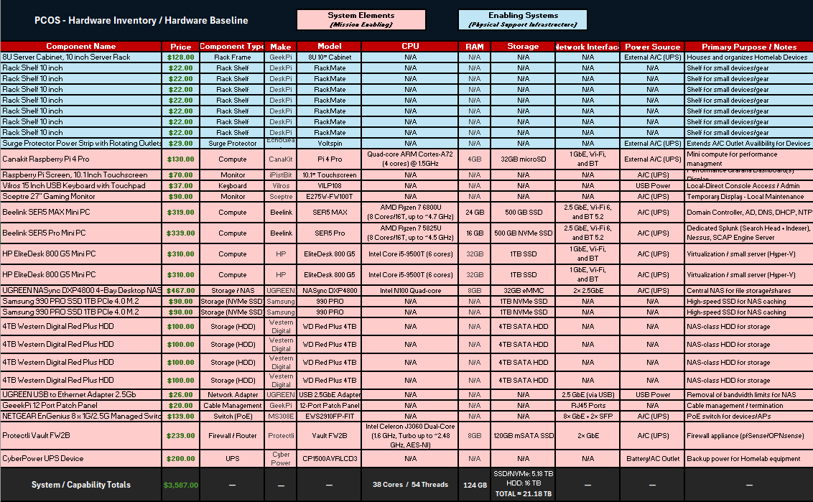
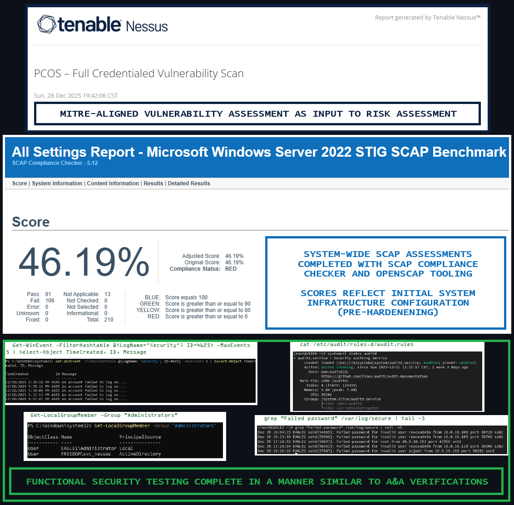
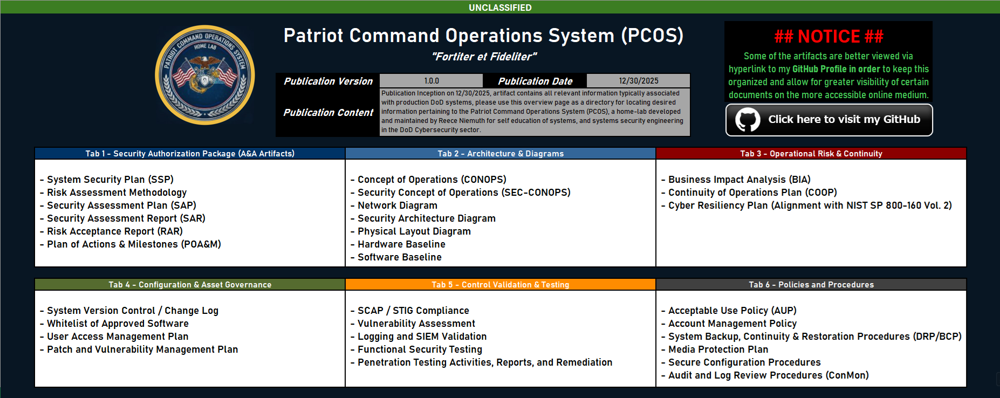

  

My **Patriot Command Operations System (PCOS)** project is a fully documented, RMF-aligned security enclave that demonstrates end-to-end system engineering—from architecture and baselining through assessment, risk, remediation, authorization, and continuous monitoring—using real tools, real findings, and auditable evidence.

---

### Feel free to walk through the RMF and review my project highlights from a holistic, DoD-aligned, perspective below!

  

---

### 🏗️ Step 1: CATEGORIZE (Architecture & System Definition)

PCOS is a self-contained, RMF-aligned lab enclave designed to model DoD-style system architecture, security control implementation, assessment, and continuous monitoring using real tools and evidence.

**High-Level Architecture Overview:**

<table>
  <tbody>
    <tr>
      <td><strong>Total Hosts</strong></td>
      <td>10 Active Compute Endpoints</td>
    </tr>
    <tr>
      <td><strong>Operating Systems</strong></td>
      <td>
        1 × Windows Server 2022 (Domain Services) 
        5 × Windows 11 (Client Systems) 
        4 × AlmaLinux 9 (RHEL 9 Kernel)
      </td>
    </tr>
    <tr>
      <td><strong>Network Architecture</strong></td>
      <td>Private LAN (non-routable, segmented, lab-controlled)</td>
    </tr>
    <tr>
      <td><strong>Identity &amp; Access Management</strong></td>
      <td>Active Directory Domain Services (centralized authentication &amp; authorization)</td>
    </tr>
    <tr>
      <td><strong>Core Infrastructure Services</strong></td>
      <td>Centralized DNS, DHCP, and NTP provided by Windows Server 2022</td>
    </tr>
    <tr>
      <td><strong>Security Monitoring</strong></td>
      <td>Splunk SIEM for centralized log aggregation, analysis, and correlation</td>
    </tr>
    <tr>
      <td><strong>Vulnerability Management</strong></td>
      <td>Tenable Nessus (credentialed vulnerability scanning)</td>
    </tr>
    <tr>
      <td><strong>Configuration Compliance</strong></td>
      <td>DISA STIG / SCAP assessments via SCC (Windows) and OpenSCAP (Linux)</td>
    </tr>
    <tr>
      <td><strong>Assessment Scope</strong></td>
      <td>Host-based security posture, configuration baselines, and control verification</td>
    </tr>
    <tr>
      <td><strong>Trust Boundary</strong></td>
      <td>Single controlled enclave with defined internal trust relationships</td>
    </tr>
    <tr>
      <td><strong>Intended Use</strong></td>
      <td>Security engineering, RMF artifact generation, control validation, and automation development</td>
    </tr>
  </tbody>
</table>

**Sanitized Network Diagram:**

  

**Hardware Baseline / System Funding:**

  

**Physical Layout Diagram:**

  

---

### 📋 Step 2: SELECT (System Baseline & Control Selection)
The PCOS applies DoD/DISA-aligned security baselines and applicable STIGs to establish comprehensive initial control coverage, serving as a realistic starting point for assessment, risk identification, and remediation.

Control Selection aims to accomplish a balance between realism and feaslibility of a homelab. Oftentimes, controls are too complex or strict for the PCOS intention, details listed in PCOS SCTM **(PRIVATE REPO).**

System Baselining tools used: 
> Windows Hosts Baselined with **[SCAP Compliance Checker : NIWC : Navy.mil](https://www.niwcatlantic.navy.mil/Technology/SCAP/)**

> Linux Hosts Baselined with **[OpenSCAP : Open Source Security Compliance](https://www.open-scap.org/)**

---

### 🔧 Step 3: IMPLEMENT (Security Control Implementation)
The PCOS implements selected security controls across Windows and Linux hosts using standardized system builds, secure configuration baselines, and centralized security tooling designed for pure educational focus and upskilling.

**Overall, the Implementation approach includes:**
- Operating system hardening aligned to applicable STIG requirements (NIWC SCC, and OpenSCAP)
- Identity and access controls (Windows Server Domain Services + Linux Realmd & oddjob windows domain / authentication join)
- Audit policy and logging configuration (auditpol + auditctl enforced by GPO, followed through to Splunk function)
- Deployment of security assessment and monitoring tools (Splunk, and Nessus)
- Initial configuration of patching and update mechanisms (Nessus detection of gaps / missing updates requiring remediation)

> Control implementations are tested beforehand with change management invokation and proper research of possible conflicts

> All configurations are properly logged and the full accountability is maintained in the PCOS Maintenance / Configuration Log (accessible in **(PRIVATE REPO).**)

> Control implementations are validated during assessment and refined through documented remediation activities.

---

### 🧪 Step 4: ASSESS (Risk Assessment & Validation)
The PCOS performs automated and manual security assessments to validate control effectiveness, identify vulnerabilities, and establish an evidence-based risk posture using three main methods.

**1️⃣ Tenable Nessus** - Credentailed Vulnerability Scanning

**2️⃣ SCAP Assessment Engines** - Comfiguration Compliance (SCC Tool and OpenSCAP)

**3️⃣ Functional Security Testing** - Common System Checks

  

---

### ⚖️ Step 5: AUTHORIZE (Risk Determination & Authorization)
The PCOS documents, analyzes, and formally accepts residual risk through structured risk reports and POA&M artifacts to support an informed authorization decision. (Simulated Authority)

Risk is properly calculated, documented, and prepared for decision by the simulated Authorization Official (AO) using...

- Security Assessment Report (SAR) (accessible in **(PRIVATE REPO).**)
- Risk Assessment Report (RAR) (accessible in **(PRIVATE REPO).**)
- POA&M w/ entries with NIST SP 800-53 Control Weaknesses mapped (accessible in **(PRIVATE REPO).**)

---

### 📈 Step 6: MONITOR (Continuous Monitoring)
The PCOS continuously tracks security posture through logging, periodic rescanning, configuration awareness, and remediation follow-up to detect drift and emerging risk.

Continuous Monitoring is practiced in the PCOS (with realistic limitations) using the following approaches and considerations...

- Patch and update tracking in the PCOS Maintenance / Configuration Log (accessible in **(PRIVATE REPO).**)
- Configuration drift awareness by historical comparison of SCAP reports on a host-by-host basis (accessible in **(PRIVATE REPO).**)
- Continuous logging and monitoring strategy, which is a dedicated policy artifact for the PCOS (accessible in **(PRIVATE REPO).**)
- Re-scan cadence (SCAP / Nessus) to simulate a lifetime management of vulnerability mitigation overtime (accessible in **(PRIVATE REPO).**)
- Ongoing POA&M tracking and remediation lifecycle, updates and POA&M archive maintained (accessible in **(PRIVATE REPO).**)

---

### Detailed documentation for the PCOS is hosted / located on the **PRIVATE** version of my Homelab Repository, should you wish to review the repository will full details...

**The full library of artifacts on the PCOS to best mirror DoD-Related system workflows, preperation, assessment, maintenance, etc. is as follows:**

  

> **[Click here to request access to the PRIVATE Homelab Repository!](https://github.com/ReeceNiemuth/HomeLab-ISSE-Collection-PUBLIC/issues/new?template=request-access.yml)**
