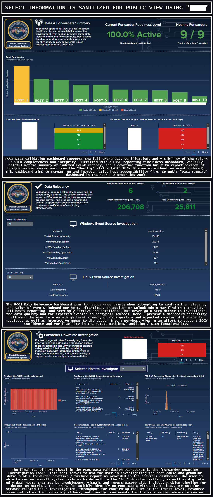

  

---

### Review a bit deeper here!

  🧩 <i><a href="HomeLab-ISSE-Collection-PUBLIC/tree/main/showcase/splunk-dev/apps">Click here to review some of my Custom Splunk Apps</a> </i>

  🛠️ <i><a href="HomeLab-ISSE-Collection-PUBLIC/tree/main/showcase/splunk-dev/apps">Click here to review some of my Custom Splunk Technical Add-Ons (TAs)</a> </i>

  📊 <i><a href="HomeLab-ISSE-Collection-PUBLIC/tree/main/showcase/splunk-dev/apps">Click here to review some of my Custom Splunk Dashboards</a> </i>

---

<h3>Heres a little dump of the Splunk stuff I have built that (I think) is pretty sweet! 😎</h3>

**End-to-End Data Validation & Forwarder Operability Tool**

  

---

**DoD-Relevent, Comprehensive Object Accountability and Auditing Tool**

  

